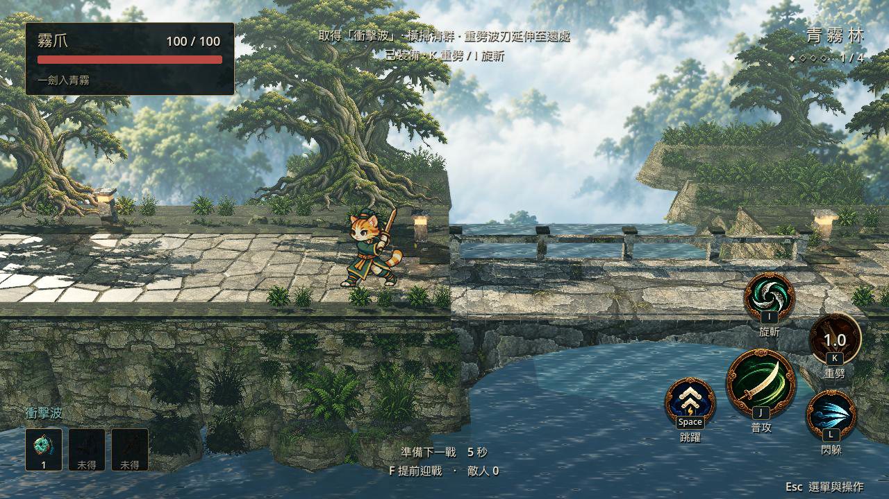
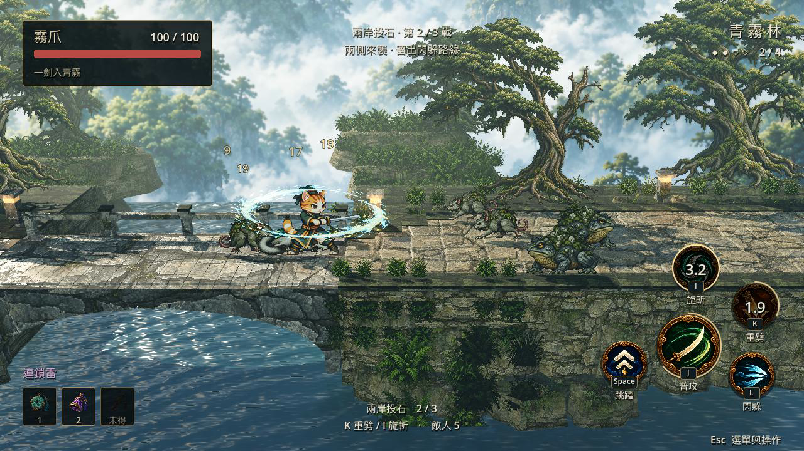
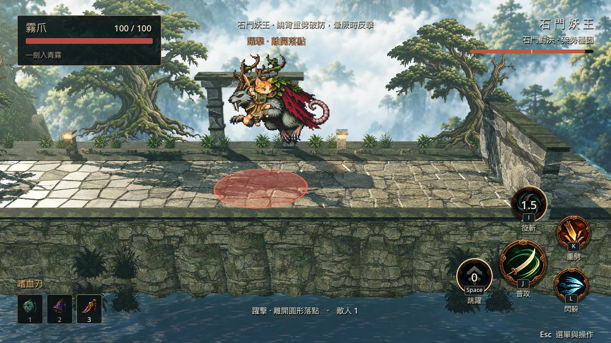

# Mistpaw

**English** · [繁體中文](README.zh-TW.md)

Mistpaw is a playable single-level action RPG built with Godot 4.7.2 and GDScript. It combines fast keyboard combat, grouped enemy encounters, loot, relic builds, a multi-phase boss, and an HD-2D-inspired forest rendered from layered pixel art and 3D scenery.

Source version: **0.1.1** · [Play the Web demo](https://mistpaw.eighti.app/) (version 0.1.0; the desktop 0.1.1 lighting update is not deployed yet).

The source code is licensed under MIT. Artwork, audio, fonts, logos, screenshots, and recordings have [separate terms](ASSET_LICENSES.md).

## Highlights

- A complete single-level run with grouped enemies, three-hit basic combos, heavy attacks, spinning attacks, dodges, double jumps, three relic builds, loot collection, death, retry, and completion results.
- A multi-phase boss with distinct attacks, frontal guard, guard break, stun windows, enrage behavior, and dedicated battle music.
- Layered pixel characters in a 3D forest, stone bridge, and lakeside environment with combat lighting, tree shadows, water reflections, particles, and positional audio.
- Manual keyboard combat on desktop and a landscape multi-touch HUD for the Web demo.
- Scripted smoke, retry, atmosphere, geometry, full-route, and rendering benchmark checks.

[Detailed release notes (Traditional Chinese)](docs/release-notes.md) · [Contributing](CONTRIBUTING.md) · [MIT license](LICENSE)

## Screenshots and gameplay

These are actual **0.1.1 desktop Forward+** frames with the current lighting update. They are not concept renders or AI-enhanced screenshots. The hosted Web demo uses an older build and the Compatibility renderer, so its visuals differ from these captures.

[](https://github.com/Chuanyin1202/mistpaw/releases/download/v0.1.1/mistpaw-demo.mp4)

**[Watch or download the full gameplay video with sound (85.6 seconds, 720p60)](https://github.com/Chuanyin1202/mistpaw/releases/download/v0.1.1/mistpaw-demo.mp4)** · [Release](https://github.com/Chuanyin1202/mistpaw/releases/tag/v0.1.1)





The playthrough uses normal scripted inputs and completes the level with combos, heavy attacks, spins, dodges, double jumps, relics, and a boss guard break. Health and damage rules are unchanged. Godot Movie Maker records with a fixed simulation step and preserves the game audio; the video's 60 fps output is not a real-time performance benchmark.

## Requirements

- Godot **4.7.2**
- macOS or another desktop platform supported by Godot 4
- Web export templates matching the installed Godot version, only when building the Web demo

The current release was validated on macOS with the Metal Forward+ renderer. Windows has not yet been tested on physical hardware.

## Run locally

```sh
git clone https://github.com/Chuanyin1202/mistpaw.git
cd mistpaw
godot --headless --editor --import --quit
godot --path .
```

Use `godot --path . --editor` to open the editor, or import `project.godot` and press F5. The first launch imports and warms the bundled assets. On macOS, `scripts/play.command` can also launch the project from Finder.

## Controls

| Action | Input |
|---|---|
| Move / face | WASD or arrow keys; the last facing direction is retained |
| Basic attack | J; hold to continue the combo, including without a target |
| Heavy / spin | K / I; 2.8 / 3.4 second cooldown |
| Dodge | L; 0.18 second dash, 1.1 second cooldown |
| Double jump | Space, then Space again while airborne |
| Run | Double-tap the same direction within 0.16 seconds and hold the second press |
| Relic build | 1 / 2 / 3 after collecting each relic |
| Start next encounter | F |
| Menu / mute / retry | Esc / M / R; Enter also retries after a run |

The desktop build defaults to manual keyboard combat. An optional automatic basic attack can be enabled from the Esc menu. Mouse position does not affect combat direction. The Web build includes a landscape virtual joystick, multi-touch action buttons, and safe-area layout.

The run contains three encounter regions followed by the boss. Each region varies enemy composition, formation, and entry direction. Relics must be collected before their builds become available. Entering a new region restores 20 health; reaching zero health shows a defeat and retry flow. The result screen reports completion time, enemies defeated, and damage taken.

The intended first-play length is three to five minutes, but this has not yet been validated with a formal first-time-player study. Scripted completion time is not presented as human playtime.

## Validation

```sh
godot --headless --path . --editor --import --quit
godot --headless --path . --script tests/smoke.gd
godot --headless --path . --script tests/retry.gd
godot --headless --path . --script tests/atmosphere.gd
godot --headless --path . --script tests/flagstone_paving.gd
godot --path . --script tests/route.gd
godot --path . --script tests/quality_benchmark.gd
```

Generated logs and captures are written to the ignored `build/verification/` directory.

Reusable implementation examples include action input, attack combos, contact-driven hit feedback, enemy telegraphs, loot beams and attraction, layered audio, touch controls, and environment materials. These remain game modules rather than a packaged framework.

Asset provenance and hashes are recorded in `assets/provenance.json`; production notes are under `assets/source/`. No image-generation or audio-service API key is required to run the game. External production sources referenced in metadata are not runtime dependencies.

Current scope excludes multiple levels, inventory progression, gamepad support, multiplayer, native Android/iOS packaging, and verified Windows hardware support. The Web and desktop renderers do not provide identical visual quality.

## Build and serve the Web version

```sh
./web/export.sh
python3 web/serve.py --root build/web --port 8095
```

Open <http://localhost:8095/>. The export script expects the matching single-threaded Web templates under `build/toolchain/` and copies the custom launch logo into the output.

Desktop browsers center the 1280×720 game without upscaling and proportionally reduce it in smaller windows. Landscape phones retain a 720-pixel render height and extend horizontal view instead of stretching the scene. Portrait mode shows the complete loading screen and pauses active gameplay with a rotate-device prompt. The bundled Noto Sans TC font covers Traditional Chinese UI text.

The Web build defaults to the high visual preset but uses Godot's Compatibility renderer. It does not include desktop Forward+ volumetric fog, screen-space reflections, or depth-of-field blur. Compatibility-specific lighting and water color corrections are applied without changing the desktop settings.

Mobile Web controls support multi-touch actions and sustained joystick running. Releasing a touch, cancellation, pause, or loss of focus clears held input state. The touch layer has 39 synthetic input checks covering relic selection, sustained running, and signed touch identifiers.

Mobile browsers require HTTPS for the engine's secure-context checks. For temporary testing, expose the local server through an HTTPS tunnel. Safari users can add the site to the Home Screen to open it without the browser address bar.

On touch devices, holding the joystick outside its 22% center dead zone for 0.35 seconds reaches the full 7.2-unit-per-second run speed. Direction reversal, releasing toward the center, cancellation, and pause reset the run state.

### Self-hosting

The game runs in the player's browser; the server only provides static files. Deploy the complete `build/web/` directory to an HTTPS static host without changing its filenames or structure. When changing domains, update the site URL in `web/shell.html`, `web/manifest.webmanifest`, and the social sharing metadata.

Linux deployments can adapt the [systemd service example](web/mistpaw-web.service). It assumes a dedicated `mistpaw` service account, `web/serve.py` installed as `/srv/mistpaw/serve.py`, and exported files under `/srv/mistpaw/current/`. The example listens only on localhost and requires an HTTPS reverse proxy for public access.

The social preview image is `web/mistpaw-og.png`, and the launch logo is `web/mistpaw-logo.png`. Production deployments should omit diagnostic exports and leave diagnostic collection disabled.
